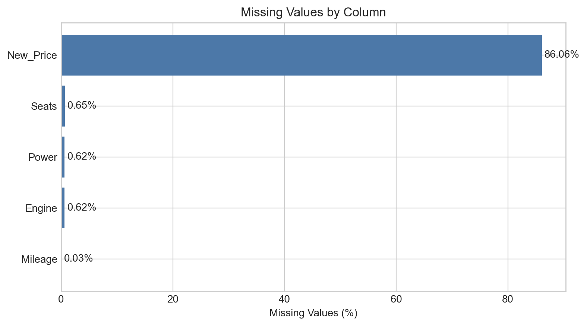
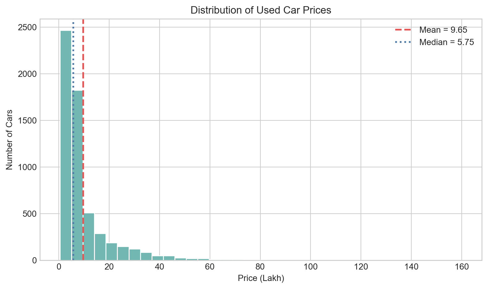
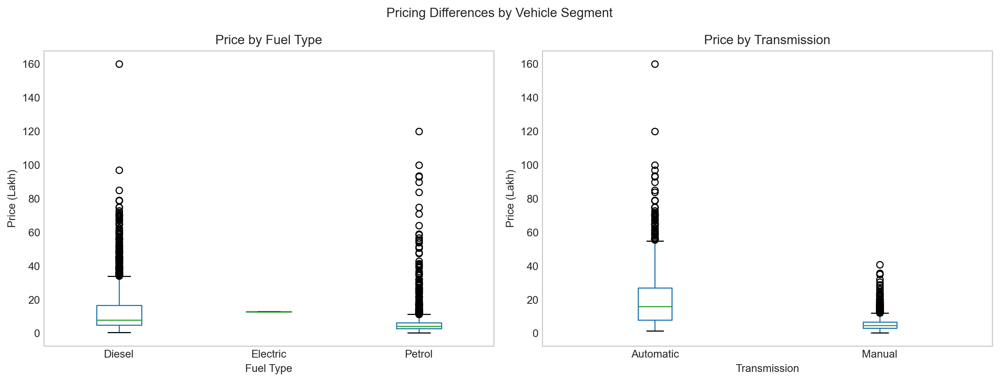
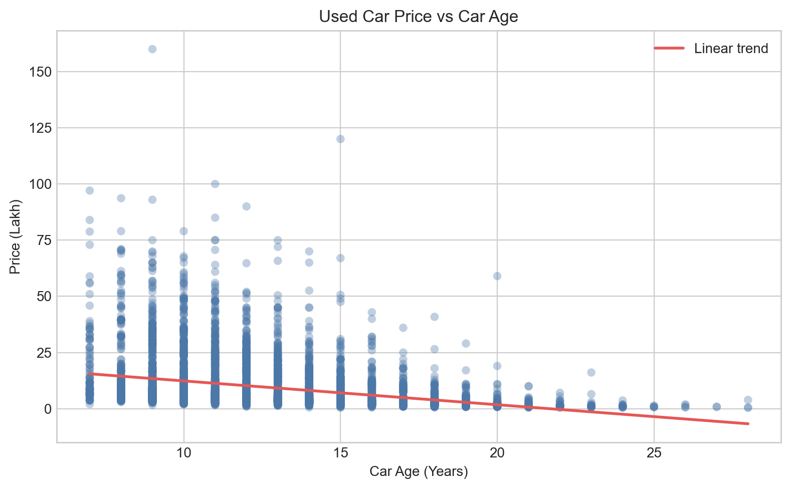
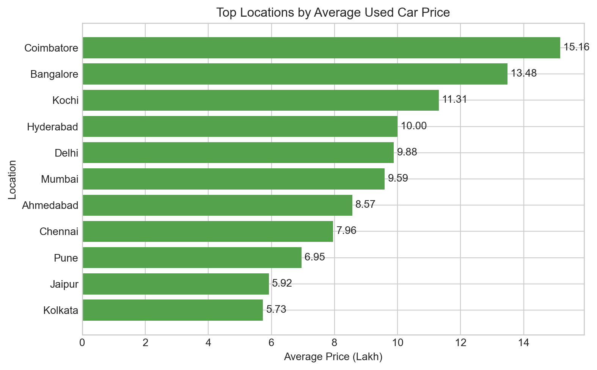
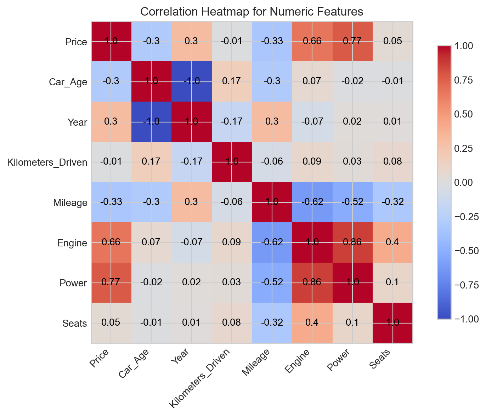

# Question 1 Findings

## Missing-Value Handling

| index | missing_count | missing_percent |
| --- | --- | --- |
| New_Price | 5032 | 86.06 |
| Seats | 38 | 0.65 |
| Engine | 36 | 0.62 |
| Power | 36 | 0.62 |
| Mileage | 2 | 0.03 |

Interpretation: `New_Price` dominates the missing-data problem, so dropping that column after numeric conversion is more defensible than filling thousands of artificial values.

## Saved Analytical Figures

## Key Findings

- Average used car price in the cleaned dataset is **9.65 lakhs**, while the median price is **5.75 lakhs**.
- The correlation between price and car age is **-0.30**, showing that older cars tend to sell for less.
- The correlation between price and engine power is **0.77**, suggesting that more powerful cars generally sell at higher prices.
- The location with the highest average selling price is **Coimbatore** at **15.16 lakhs**.
- The most expensive segment by average price is **Diesel / Automatic** at **24.62 lakhs**.

Interpretation:
The pricing analysis suggests that used car prices are influenced more strongly by vehicle performance and market segment than by age alone. The negative relationship between `Car_Age` and `Price` is present, but it is only moderate. In contrast, the strong positive relationship between `Power` and `Price` indicates that higher-performance cars retain noticeably higher prices in the resale market. The location and segment summaries also show that the resale market is not uniform across cities or vehicle categories.

## Location Summary Across All Locations

| Location | Average_Price_Lakh | Median_Mileage | Average_Car_Age | Listing_Count |
| --- | --- | --- | --- | --- |
| Coimbatore | 15.16 | 18.15 | 10.58 | 631 |
| Bangalore | 13.48 | 17.0 | 13.16 | 352 |
| Kochi | 11.31 | 18.6 | 10.47 | 640 |
| Hyderabad | 10.0 | 19.0 | 13.17 | 710 |
| Delhi | 9.88 | 17.52 | 12.65 | 540 |
| Mumbai | 9.59 | 17.26 | 12.65 | 762 |
| Ahmedabad | 8.57 | 18.9 | 12.66 | 218 |
| Chennai | 7.96 | 18.13 | 13.93 | 476 |
| Pune | 6.95 | 17.8 | 13.58 | 590 |
| Jaipur | 5.92 | 19.3 | 13.39 | 403 |
| Kolkata | 5.73 | 19.0 | 12.87 | 525 |

## Segment Summary

| Fuel_Type | Transmission | Average_Price_Lakh | Median_Km | Average_Car_Age | Listing_Count |
| --- | --- | --- | --- | --- | --- |
| Diesel | Automatic | 24.62 | 50000.0 | 11.94 | 1106 |
| Electric | Automatic | 12.88 | 47000.0 | 12.5 | 2 |
| Petrol | Automatic | 11.25 | 39000.0 | 12.45 | 604 |
| Diesel | Manual | 6.69 | 65000.0 | 12.36 | 2055 |
| Petrol | Manual | 4.16 | 45105.0 | 13.1 | 2080 |

## Overall Conclusion

The report shows that the required preprocessing steps were not only performed but also used to produce interpretable results. Missing values were handled in a justified way, categorical columns were encoded, and the added `Car_Age` feature helped reveal a meaningful relationship between age and resale price. The saved figures and summary tables together show that price tends to be higher for stronger engines, automatic vehicles, and some specific city markets, while older vehicles generally sell for less.
