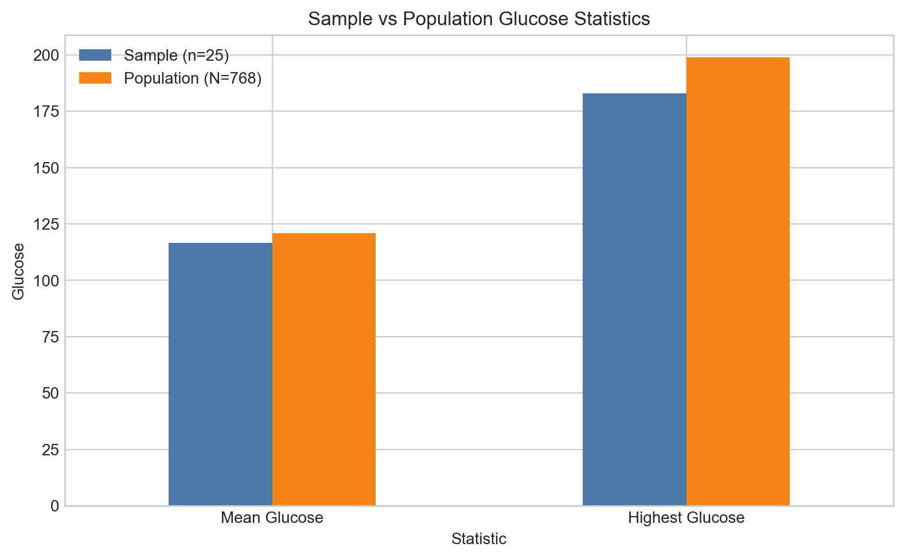
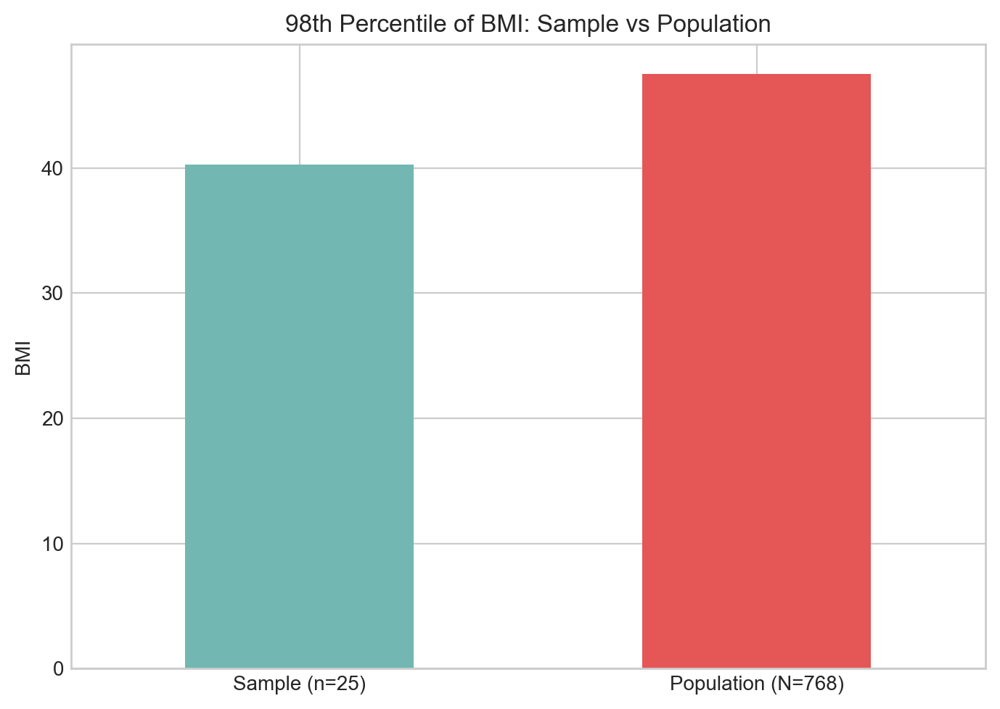
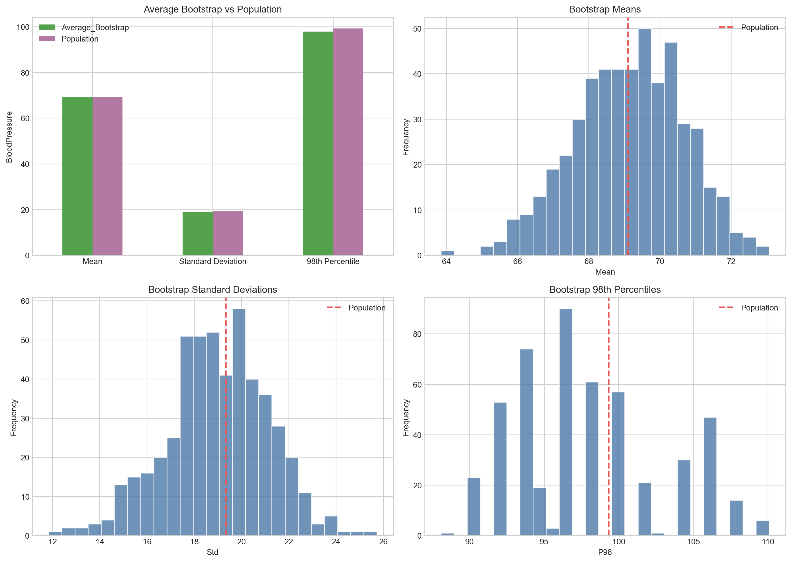
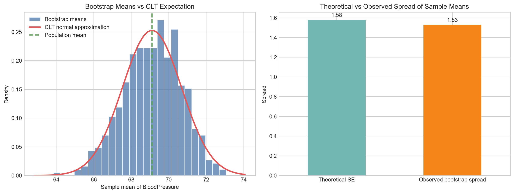

# Question 2 Findings

## Part (a) - Glucose Comparison

| index | Sample (n=25) | Population (N=768) |
| --- | --- | --- |
| Mean Glucose | 116.64 | 120.89453125 |
| Highest Glucose | 183.0 | 199.0 |

- Seed used: **42**
- Sample mean Glucose: **116.64**
- Population mean Glucose: **120.89**
- Sample highest Glucose: **183**
- Population highest Glucose: **199**

Finding:
The sample mean is fairly close to the population mean, with a difference of about **4.25** glucose units. This suggests that the random sample captures the central tendency of the population reasonably well. However, the sample maximum is lower than the population maximum by **16** units, which shows that a small sample may fail to capture the most extreme observations present in the full population.

## Part (b) - BMI 98th Percentile

- Sample BMI 98th percentile: **40.25**
- Population BMI 98th percentile: **47.53**

Finding:
The sample 98th percentile is lower than the population 98th percentile by about **7.28** BMI units. This is expected because extreme-percentile estimates are very sensitive to sample size. A sample of 25 observations is much less likely to contain the most extreme BMI values than the full population of 768 patients.

## Part (c) - Bootstrap Summary

| Statistic | Average_Bootstrap | Population |
| --- | --- | --- |
| Mean | 69.1359 | 69.1055 |
| Standard Deviation | 18.9835 | 19.3432 |
| 98th Percentile | 97.8882 | 99.32 |

### Bootstrap 95% Empirical Intervals

| Statistic | P2_5 | Median | P97_5 |
| --- | --- | --- | --- |
| Mean | 66.0032 | 69.2366 | 71.8067 |
| Std | 14.638 | 18.9973 | 22.8574 |
| P98 | 90.04 | 96.18 | 108.0 |

### How the 500 Samples Were Created

- Number of bootstrap samples: **500**
- Observations in each bootstrap sample: **150**
- Sampling method: **with replacement**
- Average number of unique observations inside a bootstrap sample: **136.53**

Because the resampling is done with replacement, repeated observations can appear inside the same sample. That behavior is correct for bootstrap sampling. If repetition were not allowed inside a sample, the method would no longer be bootstrap resampling.

### Theoretical Expectation

For the sample mean, the **Central Limit Theorem** gives a useful theoretical expectation. With a sample size of **150**, the distribution of the sample means should be approximately normal and centered near the population mean.

- Population mean of `BloodPressure`: **69.11**
- Population standard deviation of `BloodPressure`: **19.34**
- Theoretical standard error of the sample mean: **19.34 / sqrt(150) ≈ 1.58**

From the 500 bootstrap samples, the observed standard deviation of the sample means is about **1.53**, which is very close to the theoretical value of **1.58**. This supports the idea that the sample means are behaving as expected.

The standard deviation and the 98th percentile do not have such a simple interpretation as the sample mean under the Central Limit Theorem. They should still stabilize around the population values when the sample size is reasonably large, but they are expected to vary more from sample to sample than the mean. This is also visible in the bootstrap histograms, where the percentile distribution is wider than the mean distribution.

The CLT figure gives a direct visual check. The histogram of the 500 bootstrap means is close to a bell-shaped curve centered near the population mean, and the observed bootstrap spread of the means (**1.53**) is very close to the theoretical standard error (**1.58**).

### Comparison With Population

- Mean difference: **69.1359 - 69.1055 = 0.0304**
- Standard deviation difference: **18.9835 - 19.3432 = -0.3597**
- 98th percentile difference: **97.8882 - 99.3200 = -1.4318**

### Finding

The bootstrap analysis compares the statistics from all 500 samples with the statistics from the full population in two ways: first through the average bootstrap values, and second through the full distributions shown in the histograms.

- The **average bootstrap mean** is extremely close to the population mean.
- The **average bootstrap standard deviation** is slightly lower than the population standard deviation, but still close overall.
- The **average bootstrap 98th percentile** is also close to the population 98th percentile, with only a modest difference.

The histogram panels in the chart are important because they show the variation across all 500 samples, not just the average. In each case, the population value falls inside the main body of the bootstrap distribution, which indicates that the resampled statistics are consistent with the population statistic.

Overall, the bootstrap procedure provides a good approximation of the population behavior of `BloodPressure`. The repeated resamples show how the statistic changes from sample to sample, while the population line gives a direct reference point for judging how close the bootstrap estimates are to the full dataset.

## Overall Interpretation

- Part (a) shows that a small random sample can estimate the population center fairly well, but may miss the most extreme values.
- Part (b) shows that upper-tail percentiles are much more sensitive to limited sample size.
- Part (c) shows that comparing all 500 bootstrap samples with the full population gives a clear picture of sampling variability and confirms that the bootstrap averages remain close to the population values.
